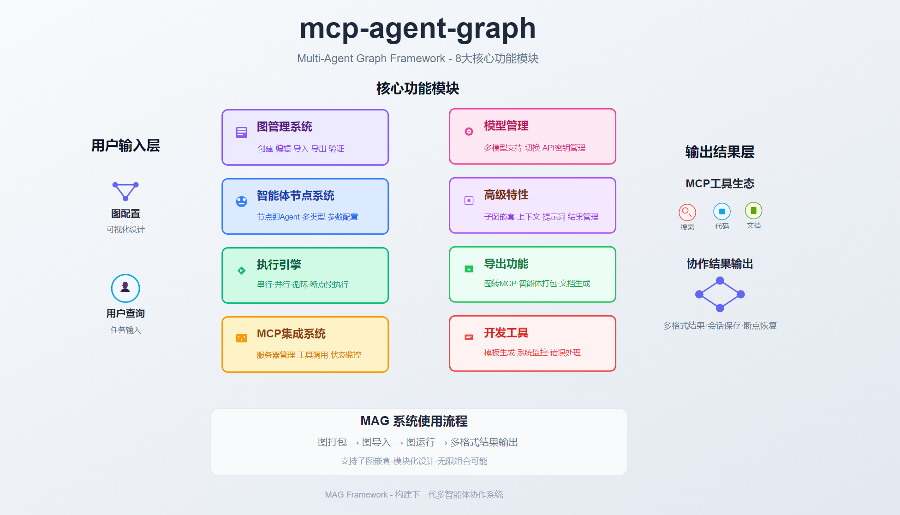

# MCP Agent Graph (MAG)

English | [中文](README_CN.md)

> MCP Agent Graph (MAG) is an agent development framework for rapidly building agent systems. This project is based on graphs, nodes, and MCP to quickly build complex Agent systems.

📚 [Documentation](https://keta1930.github.io/mcp-agent-graph/#) | 📦 [PyPI Package](https://pypi.org/project/mcp-agent-graph/) | 📄 [Design Philosophy & Roadmap](docs/一文说清%20mcp-agent-graph%20设计理念、功能特点、未来规划.pdf)

<div align="center">



</div>

## 📚 Table of Contents

- [🚀 Deployment Guide](#-deployment-guide)
  - [Option 1: Install via PyPI (Recommended)](#option-1-install-via-pypi-recommended)
  - [Option 2: Using Conda](#option-2-using-conda)
  - [Option 3: Using uv](#option-3-using-uv)
  - [Frontend Deployment](#frontend-deployment)
- [✨ Core Features](#-core-features)
- [🏗️ Development Details](#️-development-details)
- [🖼️ Frontend Feature Showcase](#️-frontend-feature-showcase)
  - [Visual Agent Graph Editor](#visual-agent-graph-editor)
  - [MCP Server Integration](#mcp-server-integration)
  - [Nested Graphs (Graph as Node)](#nested-graphs-graph-as-node)
  - [Graph to MCP Server Export](#graph-to-mcp-server-export)
- [📖 Citation](#-citation)
- [⭐ Star History](#-star-history)

## 🚀 Deployment Guide

### Frontend Deployment

```bash
# Navigate to frontend directory
cd frontend

# Install dependencies
npm install

# Run development server
npm run dev
```

The frontend development server will run on port 5173.

### Backend Deployment

### Option 1: Install via PyPI (Recommended)

```bash
# Install mag package directly from PyPI
pip install mcp-agent-graph

# View examples
# Clone repository to get example code
git clone https://github.com/keta1930/mcp-agent-graph.git
cd mcp-agent-graph/sdk_demo
```

> **Update**: Starting from version v1.3.1, we officially released the Python SDK. You can now install and use it directly via pip. The latest SDK version is v1.3.7

> **Tip**: We provide usage examples in the sdk_demo directory.

### Option 2: Using Conda

```bash
# Create and activate conda environment
conda create -n mag python=3.11
conda activate mag

# Clone repository
git clone https://github.com/keta1930/mcp-agent-graph.git
cd mcp-agent-graph

# Install dependencies
pip install -r requirements.txt

# Run main application
cd mag
python main.py
```

### Option 3: Using uv (Recommended)

```bash
# Install uv if you don't have it
Installation guide: https://docs.astral.sh/uv/getting-started/installation/

# Clone repository
git clone https://github.com/keta1930/mcp-agent-graph.git
cd mcp-agent-graph

# Install dependencies
uv sync
.venv\Scripts\activate.ps1 (powershell)
.venv\Scripts\activate.bat (cmd)

# Run directly with uv
cd mag
uv run python main.py
```

The backend server will run on port 9999, with the MCP client running on port 8765.

### Quick Start
```text
The project provides a sdk_demo\deepresearch.zip file in the mag/sdk_demo directory, which can be directly imported into the frontend to run the DEMO
```

## ✨ Core Features

#### 1️⃣ Graph-based Agent Development Framework
Provides an intuitive visual environment that allows you to easily design and build complex agent systems.

#### 2️⃣ Node as Agent
Each node in the graph is an independent agent that can leverage MCP server tool capabilities to complete specific tasks.

#### 3️⃣ Graph Nesting (Hierarchical World)
Supports using entire graphs as nodes within other graphs, enabling hierarchical agent architectures and building "Agents within Agents".

#### 4️⃣ Graph to MCP Server
Export any graph as a standard MCP server Python script, making it callable as an independent tool by other systems.

#### 5️⃣ Agent Trading & Transfer
Package complete agent systems with all dependencies (configurations, prompts, documents) into self-contained, portable units that can be easily shared, transferred, and deployed across different environments. Automatic documentation generation creates comprehensive README files, enabling recipients to quickly understand your agent's capabilities and requirements. This feature provides solutions for agent marketplace trading, intra-organizational sharing, and inter-organizational sharing.

#### 6️⃣ Rapid Agent Development
This project provides AI image generation and prompt template functionality. Templates help LLMs better understand the project and generate better nodes and graphs. The system automatically identifies registered models and MCP servers in the project and includes them in the templates.

## 🏗️ Development Details

For detailed development information, including complete feature lists, Agent configuration references, agent node parameters, configuration examples, and advanced usage guides, please see the [Development Details Documentation](appendix/intro_en.md).

## 📖 Citation

If you find MCP Agent Graph helpful for your research or work, please consider citing it:

```bibtex
@misc{mcp_agent_graph_2025,
  title        = {mcp-agent-graph},
  author       = {Yan Yixin},
  howpublished = {\url{https://github.com/keta1930/mcp-agent-graph}},
  note         = {Accessed: 2025-04-24},
  year         = {2025}
}
```

## wechat group


## ⭐ Star History

[](https://www.star-history.com/#keta1930/mcp-agent-graph&Date)