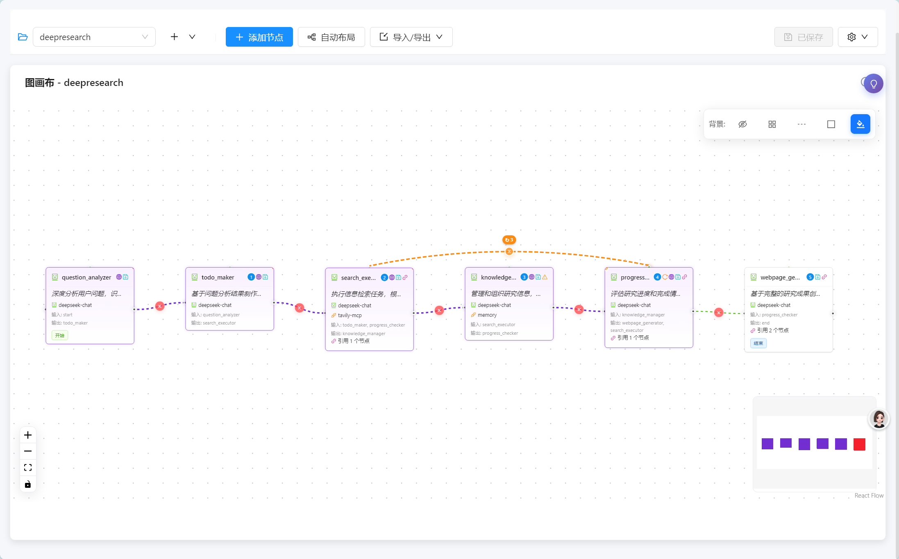
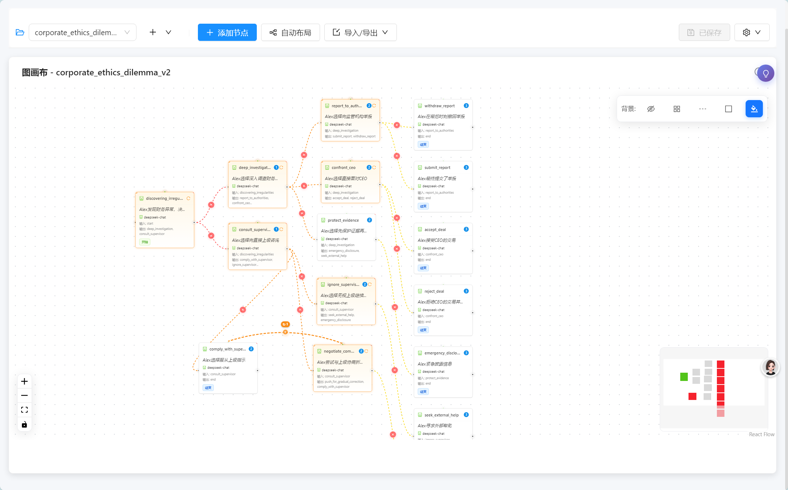

# MCP Agent Graph (MAG)

English | [中文](README_CN.md)

> MCP Agent Graph (MAG) is an agent development framework for rapidly building agent systems. This project is based on graphs, nodes, and MCP to quickly build complex Agent systems.

📚 [Documentation](https://keta1930.github.io/mcp-agent-graph/#) | 📦 [PyPI Package](https://pypi.org/project/mcp-agent-graph/) | 📄 [Design Philosophy & Roadmap](docs/一文说清%20mcp-agent-graph%20设计理念、功能特点、未来规划.pdf)


</div>

## 📚 Table of Contents

- [🚀 Deployment Guide](#-deployment-guide)
  - [Option 1: Install via PyPI (Recommended)](#option-1-install-via-pypi-recommended)
  - [Option 2: Using Conda](#option-2-using-conda)
  - [Option 3: Using uv](#option-3-using-uv)
  - [Frontend Deployment](#frontend-deployment)
- [✨ Core Features](#-core-features)
- [🏗️ Development Details](#️-development-details)
- [🖼️ Frontend Feature Showcase](#️-frontend-feature-showcase)
  - [Visual Agent Graph Editor](#visual-agent-graph-editor)
  - [MCP Server Integration](#mcp-server-integration)
  - [Nested Graphs (Graph as Node)](#nested-graphs-graph-as-node)
  - [Graph to MCP Server Export](#graph-to-mcp-server-export)
- [📖 Citation](#-citation)
- [⭐ Star History](#-star-history)

## 🚀 Deployment Guide

### Frontend Deployment

```bash
# Navigate to frontend directory
cd frontend

# Install dependencies
npm install

# Run development server
npm run dev
```

The frontend development server will run on port 5173.

### Backend Deployment

### Option 1: Install via PyPI (Recommended)

```bash
# Install mag package directly from PyPI
pip install mcp-agent-graph

# View examples
# Clone repository to get example code
git clone https://github.com/keta1930/mcp-agent-graph.git
cd mcp-agent-graph/sdk_demo
```

> **Update**: Starting from version v1.3.1, we officially released the Python SDK. You can now install and use it directly via pip. The latest SDK version is v1.3.7

> **Tip**: We provide usage examples in the sdk_demo directory.

### Option 2: Using Conda

```bash
# Create and activate conda environment
conda create -n mag python=3.11
conda activate mag

# Clone repository
git clone https://github.com/keta1930/mcp-agent-graph.git
cd mcp-agent-graph

# Install dependencies
pip install -r requirements.txt

# Run main application
cd mag
python main.py
```

### Option 3: Using uv (Recommended)

```bash
# Install uv if you don't have it
Installation guide: https://docs.astral.sh/uv/getting-started/installation/

# Clone repository
git clone https://github.com/keta1930/mcp-agent-graph.git
cd mcp-agent-graph

# Install dependencies
uv sync
.venv\Scripts\activate.ps1 (powershell)
.venv\Scripts\activate.bat (cmd)

# Run directly with uv
cd mag
uv run python main.py
```

The backend server will run on port 9999, with the MCP client running on port 8765.

### Quick Start
```text
The project provides a sdk_demo\deepresearch.zip file in the mag/sdk_demo directory, which can be directly imported into the frontend to run the DEMO
```

## ✨ Core Features

#### 1️⃣ From Need to Agent
This is an **amazing feature**! AI-generated agents. Previously, you might have needed to write extensive code to design agents or orchestrate workflows in the frontend by adding nodes one by one. mcp-agent-graph provides a solution: simply write down your requirements, and the system will generate a well-structured graph for you!

From requirements to graph in just **3 minutes** or less! Once the graph is generated, it will appear on your canvas (agent). You can examine each node of the graph, the overall flow, and the readme file! Click on any node to see which tools (mcp servers) it has selected, prompts, models, and context passing between nodes... If it doesn't meet your requirements, you can use the AI graph optimization feature to tell the AI about your updated needs, and it will adjust the workflow, add or remove nodes, modify prompts, or tool calls for you.

#### 2️⃣ Visual Graph Editor
**Canvas is Code**! You simply need to drag and drop nodes and connect lines on the visual canvas to build complex agent workflows. What you see is what you get - design is development! Each node has rich configuration options where you can directly set prompts, select models, configure tool calls, and define input-output relationships in the interface. The connections between nodes clearly show data flow and execution order, making complex logic crystal clear. Real-time preview functionality lets you see the execution effects of your current design at any time.

#### 3️⃣ Node as Agent
**Every node is an independent agent**. Each node in the graph has complete Agent capabilities! Every node can call tools and handle complex tasks. Microservice-based agent architecture where each node is a specialist! You can configure specialized role prompts for each node, making it an expert in specific domains. One node can be a data analyst, another can be a content creator, and a third can be a decision maker. They gain powerful tool capabilities through MCP servers, such as accessing file systems, web searching, performing calculations, etc. Nodes collaborate through context passing, forming powerful agent teams.

#### 4️⃣ Graph Nesting (Hierarchical World)
This is an **architectural innovation**! Building hierarchical intelligent systems with "Agent within Agent". Traditional workflows are often flat, becoming difficult to manage and maintain when systems become complex. mcp-agent-graph introduces the concept of graph nesting: any complete graph can be used as a single node within another graph! This creates infinite possibilities.

Hierarchical design with unlimited scalability! You can first build a "document analysis" graph containing document parsing, content extraction, format conversion nodes. Then encapsulate this entire graph as a node for use in a larger "knowledge management" graph. This layered design enables you to: build reusable agent modules, manage complex large-scale systems, and achieve true modular development. Each layer has clear responsibility boundaries, maintaining both system integrity and strong maintainability.

#### 5️⃣ Graph to MCP Server
This is a **standardization feature**! Export agent graphs as standard MCP services. In the AI tool ecosystem, interoperability between different platforms and frameworks has always been a challenge. mcp-agent-graph provides graph-to-mcp functionality: export any graph as a standard MCP server Python script with one click!

Build once, run everywhere! The exported MCP server fully complies with MCP protocol standards and can be directly called by Claude Desktop, Cline, Cursor, and other AI applications or any MCP-supporting systems. Your agents instantly become widely integrable tools. The exported scripts include complete dependency management, configuration files, and installation instructions, allowing recipients to deploy immediately. This lays the foundation for agent standardization and ecosystem development.

#### 6️⃣ Agent Trading & Transfer
This is an **ecosystem feature**! Complete agent packaging, sharing, and deployment solution. In the current AI development environment, sharing a complete agent system often requires complex environment configuration, dependency installation, and documentation, which greatly limits agent propagation and reuse. mcp-agent-graph provides complete agent lifecycle management: packaging agent systems and all their dependencies into self-contained, portable units.

One-click packaging, one-click deployment, agent ecosystem! The system automatically generates comprehensive README documentation detailing agent functionality, requirements, and usage methods. Recipients can quickly understand and deploy your agents without needing to understand complex technical details. This feature provides complete solutions for agent marketplace trading, team collaboration, and open-source sharing. You can easily: share professional tools with colleagues, deliver custom solutions to clients, and contribute your creations to the open-source community.

#### 7️⃣ Python SDK Deep Integration
This is a **dual-wheel development mode**! Perfect combination of frontend visual design and backend code execution. mcp-agent-graph provides through Python SDK: frontend drag-and-drop design, backend code execution! Perfect fusion of design and development - visual yet code-controllable!

You can quickly design and debug agent graphs in the frontend visual interface, then install the SDK with a single command `pip install mcp-agent-graph` and directly load and run these graphs in Python. This means: developers can integrate with code into existing systems; teams can collaborate on design through visual interfaces and ultimately deploy to production environments through code; your agent graphs can seamlessly embed into existing Python projects with free combination. The SDK provides complete graph loading, execution, and monitoring capabilities, making agent graphs powerful weapons in your code toolkit.

## 📝 Summary

mcp-agent-graph serves as a **refined, compact, and convenient** Agent development framework that simplifies the entire process from requirements to deployment.

To help you quickly experience the framework's capabilities, we provide the `deepresearch.zip` package in the project's `sdk_demo` directory. This is a complete deep research graph that you can directly import into the frontend interface to run and learn from. Through this practical example, you will gain a deep understanding of how mcp-agent-graph makes complex agent logic simple and intuitive.

Finally, thank you for reading through this article. Whether or not you choose to use this framework, we wish you all the best in your Agent development journey and hope you build your ideal intelligent applications soon!


## 
### deepresearch
#### A comprehensive research system that deeply analyzes user problems, conducts multi-round intelligent retrieval, and ultimately generates visualized HTML web pages.


### corporate_ethics_dilemma_v2
#### AI CFO Alex faces complex corporate ethical choices, exploring AI decision-making mechanisms in conflicts of interest.


## 🏗️ Development Details

For detailed development information, including complete feature lists, Agent configuration references, agent node parameters, configuration examples, and advanced usage guides, please see the [Development Details Documentation](appendix/intro_en.md).

## 📖 Citation

If you find MCP Agent Graph helpful for your research or work, please consider citing it:

```bibtex
@misc{mcp_agent_graph_2025,
  title        = {mcp-agent-graph},
  author       = {Yan Yixin},
  howpublished = {\url{https://github.com/keta1930/mcp-agent-graph}},
  note         = {Accessed: 2025-04-24},
  year         = {2025}
}
```

## wechat group


## ⭐ Star History

[](https://www.star-history.com/#keta1930/mcp-agent-graph&Date)